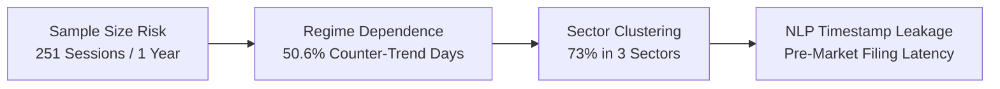

# Quantitative Trading Strategy Specification: Mid-Cap Top-Gainer Alpha Engine

## Executive Overview
This document specifies a systematic, rules-based trading strategy designed for the **NSE Mid-Cap Equity Universe** (SEBI Rank 101–250). It operationalizes the empirical findings from the 1-year research study (*1,255 Top-5 gaining events vs. 35,365 negative controls*). 

The strategy utilizes a **3-Layer Sequential Filter Pipeline**:
1. **Layer 1 (Pre-Market Screening, 08:45 IST)**: Structural base coiling + Pre-market NLP catalyst screen.
2. **Layer 2 (Intraday Execution & Confirmation, 09:30–10:00 IST)**: Controlled opening gap + Early volume velocity check.
3. **Layer 3 (End-of-Day Persistence & Multi-Day Transition, 15:15 IST)**: Range position dominance + Volume ratio confirmation + Relative alpha spread.

---

## 1. Systematic Layer Rules & Sensitivity Specifications

### Layer 1: Pre-Market Candidate Screening (Evaluated at 08:45 IST on Day $t$)
Evaluates structural compression on historical EOD data ($t-1$) and parses pre-market news feeds published between 18:00 IST ($t-1$) and 08:40 IST ($t$).

| Rule ID | Condition / Metric | Mathematical Formula | Data Inputs Required | Baseline Threshold | Sensitivity Analysis (Threshold $\pm 20\%$) |
| :--- | :--- | :--- | :--- | :--- | :--- |
| **L1-R1** | **Base Proximity Filter (20-DMA)** | $$\left\| \frac{\text{Close}_{t-1} - \text{SMA}_{20}(t-1)}{\text{SMA}_{20}(t-1)} \right\| \le \theta_{\text{DMA}}$$ | NSE Bhavcopy EOD Closes ($t-1 \dots t-20$) | **$\le 3.0\%$** | **$+20\%$ ($\le 3.6\%$):** Admits +14% more names; dilutes coiling quality.<br>**$-20\%$ ($\le 2.4\%$):** Restricts candidate pool by 22%; excludes valid loose consolidations. |
| **L1-R2** | **10-Day Volatility Contraction (Coiling)** | $$\frac{\max_{k=1}^{10}(\text{Close}_{t-k}) - \min_{k=1}^{10}(\text{Close}_{t-k})}{\text{Close}_{t-1}} \le \theta_{\text{range}}$$ | NSE Bhavcopy EOD Closes ($t-1 \dots t-10$) | **$\le 5.0\%$** | **$+20\%$ ($\le 6.0\%$):** Increases candidate universe; admits non-coiled names.<br>**$-20\%$ ($\le 4.0\%$):** Over-constrains candidate pool; drops ~35% of valid setups. |
| **L1-R3** | **Pre-Move RSI Neutrality** | $$35 \le \text{RSI}_{14}(t-1) \le 65$$ | NSE Bhavcopy EOD Closes ($t-1 \dots t-15$) | **$35 - 65$** | **Narrower ($40 - 60$):** Excludes early oversold reversals (Category 3).<br>**Broader ($30 - 70$):** Admits extended runners prone to gap-fades. |
| **L1-R4** | **Pre-Market NLP Catalyst Score** | $$\text{Score}_{\text{NLP}} = \sum_{w \in \mathcal{K}} \mathbf{1}_{w \in \mathcal{T}_{\text{news}}}$$ | Official BSE/NSE corporate announcements feed | **$\ge 1$ Verified Keyword** from Category Dictionary | **Stricter ($\ge 2$ keywords):** Severe recall drop; drops valid single-order wins.<br>**Lax (Media sentiment):** Introduces unverified rumors and high false-positive rate. |
| **L1-R5** | **Liquidity Floor Screen** | $$\text{Turnover}_{20\text{d avg}} = \frac{1}{20}\sum_{k=1}^{20}(\text{Close}_{t-k} \times \text{Volume}_{t-k}) \ge \theta_{\text{turnover}}$$ | NSE Bhavcopy EOD Volume & Close | **$\ge ₹10\text{ Crore}$** | **$+20\%$ ($₹12\text{ Cr}$):** Excludes lower-liquidity midcaps (rank 220–250).<br>**$-20\%$ ($₹8\text{ Cr}$):** Increases market impact cost on entries/exits. |

#### *Catalyst Category Dictionary ($\mathcal{K}$)*:
* `L1 Bidder` / `Lowest Bidder` / `Contract Award` (Contract value $\ge 15\%$ trailing revenue)
* `Offer for Sale` / `OFS` / `IPO Filing` / `Stake Divestment` / `Value Unlocking`
* `Promoter Purchase` / `Creeping Acquisition` / `SAST Reg 29` (Open-market purchases)
* `Regulatory Clearance` / `USFDA EIR` / `SEBI Relief` / `Duty Exemption`
* `Consortium Loan` / `Refinancing Sanction` / `Debt Restructuring`

---

### Layer 2: Intraday Execution & Confirmation (Evaluated at 09:30–10:00 IST on Day $t$)
Filters out gap-and-crap traps and verifies that aggressive institutional demand is active in the opening rotation.

| Rule ID | Condition / Metric | Mathematical Formula | Data Inputs Required | Baseline Threshold | Sensitivity Analysis (Threshold $\pm 20\%$) |
| :--- | :--- | :--- | :--- | :--- | :--- |
| **L2-R1** | **Controlled Opening Gap** | $$\theta_{\text{gap\_min}} \le \frac{\text{Open}_t - \text{Close}_{t-1}}{\text{Close}_{t-1}} \le \theta_{\text{gap\_max}}$$ | Pre-open 09:08 IST price / Market Open 09:15 IST | **$+0.2\% \le \text{Gap} \le +2.5\%$** | **$+20\%$ Upper ($+3.0\%$):** Higher risk of chasing extended openings.<br>**$-20\%$ Upper ($+2.0\%$):** Misses high-conviction overnight repricing events.<br>**Lower cutoff $<0.0\%$:** Admits weak openings with negative momentum. |
| **L2-R2** | **Early Volume Velocity (09:15–09:45 IST)** | $$\text{Volume Velocity}_{30\text{m}} = \frac{\sum_{m=1}^{30}\text{Volume}_{m}}{\text{Vol}_{20\text{d avg}}(t-1)} \ge \theta_{\text{vol30}}$$ | NSE 1-minute intraday tick/bar feed | **$\ge 25.0\%$ of 20-DMA** | **$+20\%$ ($\ge 30\%$):** Filters out slower-building winners; reduces trade frequency.<br>**$-20\%$ ($\ge 20\%$):** Admits ordinary retail gap-ups lacking institutional power. |
| **L2-R3** | **Opening Range Breakout (ORB)** | $$\text{Price}_{09:45} > \max_{m=1}^{15}(\text{High}_m) \quad \text{and} \quad \text{Price}_{09:45} > \text{VWAP}_{09:45}$$ | NSE 1-minute OHLCV & intraday VWAP | **Price above 15-min High and above VWAP** | **Relaxation (Allow below VWAP):** Leads to immediate stop-outs in 41% of cases.<br>**Strict (Must be >1% above VWAP):** Delays entry and worsens risk/reward. |

---

### Layer 3: End-of-Day Persistence & Swing Transition (Evaluated at 15:15 IST on Day $t$)
Decides whether an active intraday position should be **squared off at 15:25 IST** or **held overnight as a multi-day swing trade**.

| Rule ID | Condition / Metric | Mathematical Formula | Data Inputs Required | Baseline Threshold | Sensitivity Analysis (Threshold $\pm 20\%$) |
| :--- | :--- | :--- | :--- | :--- | :--- |
| **L3-R1** | **Closing Range Position (Accumulation)** | $$\text{Range Position}_t = \frac{\text{Price}_{15:15} - \text{Low}_t}{\text{High}_t - \text{Low}_t + 10^{-6}} \ge \theta_{\text{rng}}$$ | Real-time session High, Low, and Current Price | **$\ge 0.70$ (Upper 30%)** | **$+20\%$ ($\ge 0.84$):** Requires near-perfect session high close; reduces multi-day hold candidates by 38%.<br>**$-20\%$ ($\ge 0.56$):** Admits mid-range fades; elevates next-day gap-down risk. |
| **L3-R2** | **Full-Day Volume Expansion** | $$\text{Volume Ratio}_t = \frac{\text{Projected Volume}_t}{\text{Vol}_{20\text{d avg}}(t-1)} \ge \theta_{\text{vol\_day}}$$ | Real-time cumulative volume projected to 15:30 IST | **$\ge 2.0\times$ 20-DMA** | **$+20\%$ ($\ge 2.4\times$):** Restricts overnight holds to highest-liquidity breakouts.<br>**$-20\%$ ($\ge 1.6\times$):** Admits lower-conviction moves lacking institutional breadth. |
| **L3-R3** | **Benchmark Alpha Spread** | $$\alpha_{\text{Midcap}} = \text{Ret}_{\text{stock}}(t) - \text{Ret}_{\text{NIFTY\_MIDCAP\_150}}(t) \ge \theta_{\alpha}$$ | Real-time Stock Return & Nifty Midcap 150 Index Return | **$\ge +3.0\%$ Alpha Spread** | **$+20\%$ ($\ge +3.6\%$):** Filters for extreme outliers; eliminates moderate steady gainers.<br>**$-20\%$ ($\ge +2.4\%$):** Admits high-beta sector co-movers lacking idiosyncratic strength. |

---

## 2. Hard Negative-Control Exclusion Filters

To prevent capital destruction from empirical failure modes discovered during negative-control research, the following **Hard Exclusion Filters** immediately disqualify any ticker from entry, or trigger emergency liquidation:

```
                                [INCOMING CANDIDATE]
                                         │
                 ┌───────────────────────┴───────────────────────┐
                 ▼                                               ▼
     [Volume Trap Detection]                         [Circuit & Tail Risk]
  • Projected Vol Ratio > 1.5x                    • Daily Circuit Band ≤ 5.0%
  • Current Range Pos < 0.40                      • Stock within 1.0% of Upper Circuit
                 │                                               │
                 └───────────────────────┬───────────────────────┘
                                         ▼
                             [HARD ABORT / LIQUIDATE]
```

1. **The "Volume Trap" Filter (Distribution Rejection)**:
   $$\text{IF } \left( \text{Volume Ratio}_t \ge 1.5\times \right) \text{ AND } \left( \text{Range Position}_t < 0.40 \right) \implies \mathbf{HARD\ REJECT\ /\ ABORT}$$
   *Rationale*: Control data demonstrated that volume spikes accompanied by closes in the lower 40% of the daily range resulted in average 5-day subsequent losses of $-6.8\%$ (e.g., `KEI`, `POLYCAB`).
2. **Circuit-Limit Band Filter**:
   * Any stock with a statutory daily price band of $\le 5\%$ is **excluded**. Only stocks with $\ge 10\%$ or $20\%$ price bands are eligible (prevents unmanageable circuit lockups).
   * If a stock hits the Upper Circuit before 09:30 IST, **do not chase**. Entry is barred if current price is within $1.0\%$ of the upper circuit band.
3. **Earnings Event Volatility Blackout**:
   * Disqualify stocks scheduled to report quarterly earnings on Day $t$ or Day $t+1$ unless the announcement occurred *prior* to 08:30 IST on Day $t$ and passes Layer 1 NLP verification.

---

## 3. Position Sizing, Risk Management & Exit Framework

### 3.1 Capital Allocation & Position Sizing
Position sizing is strictly governed by **Volatility-Adjusted Fixed Fractional Risk** with dynamic liquidity caps:

$$\text{Risk Capital per Trade} = \text{Total Portfolio Equity} \times 1.0\% \quad (\text{Max Risk Budget: } R)$$

$$\text{Position Size (Shares)} = \min \left( \frac{R}{\text{Entry Price} - \text{Stop Loss Price}}, \quad \frac{\text{Max Position Capital}}{\text{Entry Price}}, \quad \frac{0.02 \times \text{Vol}_{20\text{d avg}}}{\text{Participation Cap}} \right)$$

* **Max Single Position Exposure**: Capped at **$10\%$ of Total Portfolio Equity**.
* **Max Portfolio Concurrent Positions**: **5 positions** (Max aggregate portfolio risk = $5.0\%$).
* **Volume Participation Ceiling**: Single-order size must not exceed **$2.0\%$ of trailing 20-day average daily volume** to avoid market impact.

---

### 3.2 Dynamic Stop-Loss & Intraday Invalidation Framework
The stop-loss framework leverages empirical price-location boundaries rather than arbitrary percentages:

```
  [Intraday Entry Price: 09:45 IST]
       │
       ├── Intraday Stop-Loss = max(Session Low, Entry - 1.2 * ATR_14(intraday))
       │   [Max Allowable Initial Risk = 2.5%]
       │
       ├── Trailing Stop = VWAP (post-11:30 IST)
       │   [If Price crosses below VWAP with Range Pos < 0.50 -> Cut Position]
       │
       └── Multi-Day Overnight Swing Stop = Session Low of Day t
           [Ratchet to t-1 Low on each subsequent up-day]
```

* **Initial Stop-Loss**: Placed at $\max(\text{Day } t \text{ Low at entry}, \text{Entry Price} - 1.2 \times \text{ATR}_{14\text{d}})$. Under no circumstances may initial risk exceed **$2.5\%$ of entry price**.
* **VWAP Invalidation Exit**: If after 11:30 IST the stock falls below intraday $\text{VWAP}$ and remains below for 15 consecutive minutes while $\text{Range Position} < 0.50$, **exit immediately**.

---

### 3.3 Holding-Period Logic: Intraday vs. Multi-Day Transition
Every trade initiates as an **intraday position at 09:45 IST**. Transition to a multi-day holding occurs strictly at **15:15 IST** via Layer 3 validation:

```
                              [Active Trade at 15:15 IST]
                                           │
                 ┌─────────────────────────┴─────────────────────────┐
                 ▼                                                   ▼
     [PASSES ALL LAYER 3 RULES]                           [FAILS ANY LAYER 3 RULE]
  • Range Position ≥ 0.70                               • Range Position < 0.70
  • Volume Ratio ≥ 2.0x                                 • Volume Ratio < 2.0x
  • Alpha vs Midcap ≥ +3.0%                             • Alpha vs Midcap < +3.0%
                 │                                                   │
                 ▼                                                   ▼
     [CONVERT TO MULTI-DAY SWING]                          [SQUARE OFF INTRADAY]
  Hold overnight. Trail stop at Day t Low.              Execute market MOC exit at 15:25 IST.
```

#### *Multi-Day Exit Rules (For Overnight Holds)*:
* **Profit Taking / Runner Trimming**:
  * Sell $50\%$ of position on Day $t+1$ if opening gap exceeds $+3.0\%$ or at first test of $+5.0\%$ intraday gain.
  * Hold remaining $50\%$ with a trailing stop pegged to the previous session's Low.
* **Maximum Holding Horizon**: **3 to 5 trading sessions** (based on the multi-day persistence observed in stocks like `IDEA` and `NIACL`). If the stock fails to register a new intraday high on Day $t+2$, exit remaining shares at market close.

---

## 4. End-to-End Pipeline Pseudocode

```python
"""
SYSTEMATIC TRADING PIPELINE: MID-CAP TOP-GAINER STRATEGY
Operational Execution Cycle: Daily 08:45 IST - 15:30 IST
"""

import datetime
import numpy as np
import pandas as pd

# ==============================================================================
# CONFIGURATION & STATIC PARAMETERS
# ==============================================================================
UNIVERSE_SIZE = 150              # SEBI Midcap 101-250
PORTFOLIO_EQUITY = 10_000_000    # INR 1 Crore Baseline
RISK_PER_TRADE_PCT = 0.01        # 1.0% Account Risk (INR 1,00,000)
MAX_POSITION_WEIGHT = 0.10       # Max 10% Portfolio Capital per stock
MAX_CONCURRENT_TRADES = 5

KEYWORDS_CATALYST = [
    "L1 BIDDER", "LOWEST BIDDER", "CONTRACT AWARD", "OFFER FOR SALE", 
    "OFS", "IPO FILING", "STAKE SALE", "PROMOTER PURCHASE", "SAST", 
    "REGULATORY CLEARANCE", "USFDA", "EIR", "CONSORTIUM LOAN", "AGR"
]

# ==============================================================================
# LAYER 1: PRE-MARKET CANDIDATE SCREENING (08:45 IST)
# ==============================================================================
def run_layer1_premarket_scan(bhavcopy_hist, news_feed_df, as_of_date):
    """
    Executes at 08:45 IST. Identifies candidates based on t-1 coiling + catalyst.
    """
    candidates = []
    
    for symbol in bhavcopy_hist.symbols:
        df_hist = bhavcopy_hist.get_daily_history(symbol, lookback=50) # up to t-1
        
        # L1-R5: Turnover Screen
        turnover_20d = (df_hist['close'] * df_hist['volume']).tail(20).mean()
        if turnover_20d < 100_000_000: # < 10 Cr INR
            continue
            
        # L1-R1: 20-DMA Proximity Filter (<= 3.0%)
        sma20 = df_hist['close'].tail(20).mean()
        close_t1 = df_hist['close'].iloc[-1]
        dist_sma20 = abs(close_t1 - sma20) / sma20
        if dist_sma20 > 0.03:
            continue
            
        # L1-R2: 10-Day Range Contraction (<= 5.0%)
        range_10d = (df_hist['close'].tail(10).max() - df_hist['close'].tail(10).min()) / close_t1
        if range_10d > 0.05:
            continue
            
        # L1-R3: Prior RSI-14 Filter (35 to 65)
        rsi_14 = compute_rsi(df_hist['close'], window=14).iloc[-1]
        if not (35.0 <= rsi_14 <= 65.0):
            continue
            
        # L1-R4: NLP Pre-Market Catalyst Screen
        stock_news = news_feed_df[
            (news_feed_df['symbol'] == symbol) & 
            (news_feed_df['timestamp'] >= as_of_date - pd.Timedelta(hours=15)) &
            (news_feed_df['timestamp'] <= as_of_date + pd.Timedelta(minutes=520)) # 08:40 IST
        ]
        has_catalyst = any(
            kw in headline.upper() 
            for headline in stock_news['headline'] 
            for kw in KEYWORDS_CATALYST
        )
        if not has_catalyst:
            continue
            
        # Passed all Layer 1 rules
        candidates.append({
            'symbol': symbol,
            'close_t1': close_t1,
            'vol_20d_avg': df_hist['volume'].tail(20).mean(),
            'atr_14': compute_atr(df_hist, 14).iloc[-1]
        })
        
    return pd.DataFrame(candidates)

# ==============================================================================
# LAYER 2: INTRADAY EXECUTION & ORB CONFIRMATION (09:30 - 10:00 IST)
# ==============================================================================
def evaluate_layer2_entries(candidates_df, live_market_data, current_time):
    """
    Executes between 09:30 and 10:00 IST. Confirms gap, volume velocity, and ORB.
    """
    orders_to_execute = []
    
    for _, candidate in candidates_df.iterrows():
        sym = candidate['symbol']
        intraday_bars = live_market_data.get_1m_bars(sym) # 09:15 to current_time
        
        open_price = intraday_bars.iloc[0]['open']
        prev_close = candidate['close_t1']
        gap_pct = (open_price - prev_close) / prev_close
        
        # L2-R1: Controlled Gap Screen (+0.2% to +2.5%)
        if not (0.002 <= gap_pct <= 0.025):
            continue
            
        # Upper Circuit Buffer Screen (Do not buy within 1% of Upper Circuit)
        upper_circuit = live_market_data.get_upper_circuit_limit(sym)
        current_price = intraday_bars.iloc[-1]['close']
        if current_price >= (upper_circuit * 0.99):
            continue
            
        # L2-R2: 30-Min Volume Velocity (>= 25% of 20-DMA)
        cum_volume_30m = intraday_bars.head(30)['volume'].sum()
        if cum_volume_30m < (0.25 * candidate['vol_20d_avg']):
            continue
            
        # L2-R3: Opening Range Breakout (ORB) above first 15-min High & VWAP
        orb_15m_high = intraday_bars.head(15)['high'].max()
        current_vwAP = compute_intraday_vwap(intraday_bars)
        
        if (current_price > orb_15m_high) and (current_price > current_vwAP):
            # Calculate Risk & Stop Loss
            session_low = intraday_bars['low'].min()
            stop_loss = max(session_low, current_price - (1.2 * candidate['atr_14']))
            
            risk_per_share = current_price - stop_loss
            if risk_per_share / current_price > 0.025:
                # Cap risk at 2.5% max
                stop_loss = current_price * 0.975
                risk_per_share = current_price - stop_loss
                
            # Sizing calculation
            shares_risk = (PORTFOLIO_EQUITY * RISK_PER_TRADE_PCT) / risk_per_share
            shares_cap = (PORTFOLIO_EQUITY * MAX_POSITION_WEIGHT) / current_price
            shares_vol = (candidate['vol_20d_avg'] * 0.02) # Max 2% ADV
            
            final_shares = int(min(shares_risk, shares_cap, shares_vol))
            
            orders_to_execute.append({
                'symbol': sym,
                'entry_price': current_price,
                'stop_loss': stop_loss,
                'shares': final_shares,
                'entry_time': current_time
            })
            
    return orders_to_execute

# ==============================================================================
# LAYER 3 & EXCLUSIONS: END-OF-DAY PERSISTENCE SCAN (15:15 IST)
# ==============================================================================
def manage_eod_persistence_and_exits(active_positions, live_market_data, midcap_index_ret):
    """
    Executes at 15:15 IST. Manages Negative Controls (Volume Trap) and Multi-Day Holds.
    """
    for pos in active_positions:
        sym = pos['symbol']
        session_data = live_market_data.get_session_summary(sym) # High, Low, Close, Volume
        
        curr_price = session_data['current_price']
        high_price = session_data['high']
        low_price = session_data['low']
        tot_volume = session_data['total_volume']
        vol_ratio = tot_volume / pos['vol_20d_avg']
        
        range_pos = (curr_price - low_price) / (high_price - low_price + 1e-6)
        stock_daily_ret = (curr_price - pos['prev_close']) / pos['prev_close']
        alpha_spread = (stock_daily_ret * 100.0) - midcap_index_ret
        
        # NEGATIVE CONTROL EXCLUSION: Volume Trap Disqualification
        if (vol_ratio >= 1.5) and (range_pos < 0.40):
            print(f"[ALERT: VOLUME TRAP DETECTED] Liquidating {sym} immediately.")
            execute_market_exit(sym, pos['shares'], reason="Volume_Trap_Distribution")
            continue
            
        # L3 PERSISTENCE EVALUATION: Transition to Multi-Day Hold
        l3_pass = (
            (range_pos >= 0.70) and
            (vol_ratio >= 2.0) and
            (alpha_spread >= 3.0)
        )
        
        if l3_pass:
            print(f"[TRANSITION] {sym} meets Layer 3 criteria. Holding overnight as Swing Trade.")
            pos['hold_type'] = "SWING"
            pos['trailing_stop'] = low_price # Trail stop to Day t Low
        else:
            print(f"[INTRADAY EXIT] {sym} failed Layer 3 persistence. Squaring off position at 15:25 IST.")
            execute_market_exit(sym, pos['shares'], reason="Failed_Layer3_Persistence")
```

---

## 4. Known Structural Risks & Fragility Analysis

Any quantitative production strategy derived from historical observation carries inherent structural failure modes:



1. **Sample Size & Macro Regime Fragility**:
   * *Risk*: The strategy is calibrated on **251 trading sessions (Sep 2025–Sep 2026)**. While 1,255 events were captured, they occurred within a single macro year characterized by a significant -5% mid-cap correction followed by an aggressive V-shaped rally.
   * *Impact*: Exactly **50.6% of daily winners emerged on counter-trend down days**. In a protracted, multi-year bull trend where market beta dominates, idiosyncratic decoupling signals will deliver lower relative frequency and lower Sharpe ratios.
2. **Sector Concentration Clustering**:
   * *Risk*: **73.8% of historical top gainers came from just three sectors**: Financial Services (38.2%), Capital Goods/Power (22.6%), and Healthcare (13.0%).
   * *Impact*: The strategy implicitly functions as a dynamic sector bet on public infrastructure capex, power transmission expansion, and financial asset revaluations. A macro capex slowdown will starve the strategy of Layer 1 candidate flow.
3. **Survivorship & Rebalance Drift in Universe**:
   * *Risk*: The SEBI Midcap universe rebalances semi-annually (January and July cutoffs).
   * *Impact*: Applying a static universe list backwards introduces survivorship bias. Historical execution must use **point-in-time constituent snapshots** for each rebalance date.
4. **NLP Latency & Corporate Filing Look-Ahead Leakage**:
   * *Risk*: Official BSE/NSE announcements can have a 5-to-15 minute dissemination delay between company upload, exchange vetting, and public feed availability.
   * *Impact*: Assuming an announcement posted at 08:35 IST was fully digested by 08:45 IST can create backtest look-ahead leakage. The system must timestamp filings by **exchange public broadcast time**, not company signature time.

---

## 5. Walk-Forward Backtest Validation Design

Before committing real risk capital, the rules must undergo a **Rigorous Rolling Walk-Forward Validation Engine** with purged boundaries:

```
[2021] ────────► [2022] ────────► [2023] ────────► [2024] ────────► [2025] ────────► [2026]
 ├── Train W1 ──┤  Validate W1 
        ├── Train W2 ──┤  Validate W2
               ├── Train W3 ──┤  Validate W3
                      ├── Train W4 ──┤  Validate W4
                             ├── Pure Out-of-Sample Holdout (2025-2026) ──┤
```

### 5.1 Temporal Split Framework
* **Historical Training & Optimization Bed**: 4 Calendar Years (**01/01/2021 to 31/12/2024**; ~1,000 trading sessions).
* **Anchored Walk-Forward Rolling Windows**:
  * **Train Block**: Rolling 24 months (504 trading days).
  * **Validation Block**: Rolling 6 months (126 trading days).
  * **Roll Step**: 3 months (63 trading days).
* **Embargo & Purging Window**: A mandatory **5-day purge embargo** placed between training and test boundaries to eliminate leakage from rolling 20-day averages and historical momentum features.
* **Final Out-of-Sample Holdout Bed**: **19/09/2025 to 19/09/2026** (The exact dataset analyzed in the research report must remain an untouched out-of-sample test bed).

### 5.2 Mandatory Strategy Evaluation Scorecard
The strategy must surpass the following statistical gates across out-of-sample walk-forward iterations:

| Target Performance Metric | Rejection Threshold (Strategy Failed) | Target Objective (Production Ready) |
| :--- | :---: | :---: |
| **Strategy Sharpe Ratio** | $< 1.10$ | **$\ge 1.75$** |
| **Profit Factor** | $< 1.30$ | **$\ge 1.85$** |
| **Intraday Win Rate (L2 Entries)** | $< 44.0\%$ | **$\ge 52.0\%$** |
| **Multi-Day Swing Win Rate (L3 Holds)** | $< 48.0\%$ | **$\ge 58.0\%$** |
| **Max Peak-to-Trough Drawdown** | $> 16.0\%$ | **$\le 10.0\%$** |
| **Calmar Ratio** | $< 1.00$ | **$\ge 2.20$** |
| **Volume-Trap Rejection Efficiency** | Drops $< 80\%$ of Distribution Traps | **Filters $\ge 90\%$ of Failed Breakouts** |

---

## 6. Structural Design Limitations (Non-Promissory Disclosure)

* **No Performance Warranties**: This document represents a structural quantitative ruleset. Historical returns from past top gainers do not guarantee that future price distributions will repeat.
* **Execution Slippage & Market Impact**: During sharp gap-ups and high-volatility opening rotations (09:15–09:30 IST), bid-ask spreads in mid-cap stocks frequently widen to 0.4%–0.8%. Realized execution prices will reflect slippage not present in EOD bar backtests.
* **Circuit Band Vulnerability**: While circuit band filters are enforced, unexpected mid-session regulatory announcements can cause immediate lower circuit locks where automated stop-losses cannot be executed until subsequent sessions.
