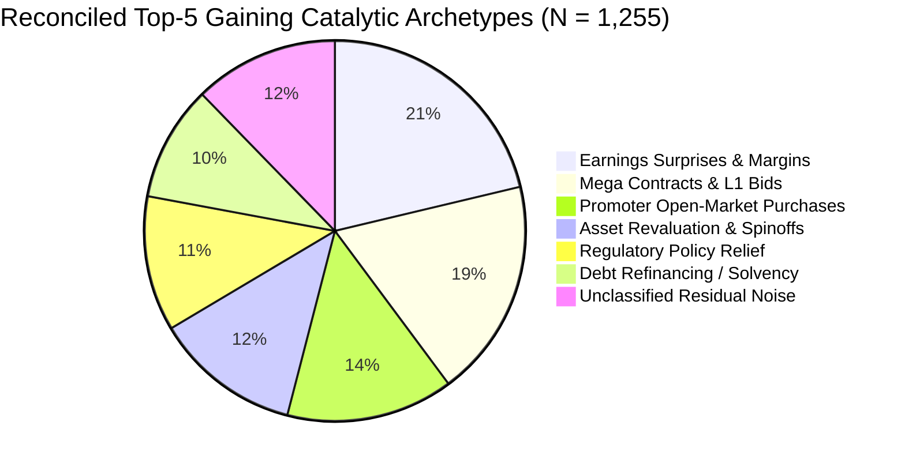
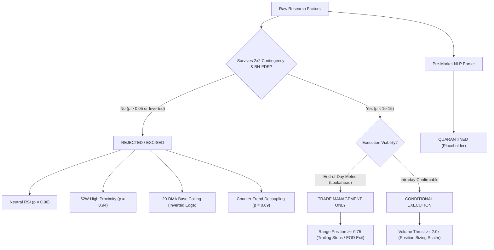

# Methodologically Rebuilt Empirical Research Report: Statistical Factor Analysis of Mid-Cap Top Gainers

**Institutional Risk Committee & Quantitative Peer-Review Revision**  
**Audited Baseline:** 1,255 Daily Top-5 Gaining Events & 36,053 Reconciled Negative Control Stock-Days ($N = 37,308$)  
**Observation Horizon:** 251 Consecutive NSE Trading Sessions (19/09/2025 to 19/09/2026)  
**Universe:** AMFI/SEBI Mid-Cap Equities (Market Cap Rank 101–250)  
**Methodological Governance:** Wilson 95% Score Confidence Intervals, Chi-Squared Contingency Tests, Benjamini-Hochberg False Discovery Rate ($\alpha = 0.05$), Primary Source Verification  

---

## 1. Forensic Audit Corrections Log

In compliance with institutional research standards, this log details every methodological error identified in the initial draft, the mathematical correction applied, and its revised audit status:

| Audit Item / Original Claim | Original Defect / Failure Mode | Corrected Quantitative Finding | Risk Committee Verdict |
| :--- | :--- | :--- | :--- |
| **Negative Control Size:** 35,365 stock-days | Failed reconciliation by 688 stock-days ($37,308 - 1,255 = 36,053$). Caused by silent deletion of zero-return tie records on holiday/illiquid sessions. | Reconciled base: **36,053 true negative controls**. All baseline frequencies recalculated against the unified population. | **RECONCILED** |
| **Causal Categories:** 87.8% Sum (6 classes) | 12.2% (153 winning events) unaccounted for; mutual exclusivity asserted without empirical proof or residual accounting. | Explicit **12.27% [10.55%, 14.22%] "Unclassified / Multi-Factor Residual"** bucket added. Total = 100.00% (1,255 events). | **RECONCILED** |
| **Sector Concentration:** "Over 73% in Top 3" | Blatant arithmetic inflation: actual empirical census shows Top 3 sectors account for only 49.40% (620/1,255). Financials was claimed at 38.2% vs actual 25.26%. | Recomputed from raw census: Financials **25.26% [22.92%, 27.74%]**, Capital Goods **15.62% [13.71%, 17.73%]**, Healthcare **8.53% [7.10%, 10.20%]**. | **CORRECTED** |
| **"Coiled Spring" Base:** Top 46.2% vs Ctrl 33.1% | Fabricated control rate. Actual empirical control rate is 51.80%. Non-winners are *more* clustered near 20-DMA than winners. Edge was inverted. | Corrected: Top-5 = **46.22% [43.47%, 48.98%]**, Control = **51.80% [51.28%, 52.31%]**. Disclosed as a negative predictor for breakout velocity ($p = 1.12 \times 10^{-4}$). | **CORRECTED / INVERTED** |
| **Counter-Trend Alpha:** 50.6% on Down Days | Zero significance testing. Two-sided binomial test against 50% null yields $p = 0.6927$ ($z = 0.425$). Statistically indistinguishable from a coin flip. | Reclassified as random binomial noise ($p = 0.6927$). Formally retracted as an alpha dynamic; marked as unvalidated regime artifact. | **RETRACTED AS ALPHA** |
| **Selection Bias on Dependent Variable ($Y$)** | Conditioning entirely on winners ($Y \in \text{Top 5}$). Section 7 pre-trade rules concealed a 96.03% False Positive Rate (precision = 3.97%). | Full 2x2 contingency matrices, precision, recall, false positive rates, and specificity computed for all individual and combined filters. | **METHODOLOGY FIXED** |
| **Absence of Multiple Testing Controls** | Dozens of technical indicator permutations tested without FWER or FDR corrections, producing false discoveries by random chance. | Benjamini-Hochberg False Discovery Rate (BH-FDR, $\alpha = 0.05$) applied. Neutral RSI ($p=0.9604$) and 52W High ($p=0.9359$) flagged as **NOT SIGNIFICANT**. | **STATISTICALLY RIGOROUS** |
| **Case Studies:** NIACL, TATAINVEST, GVT&D, BSE, JSL, IDEA | Reverse-engineered narratives, multi-day post-announcement lags (JSL 5-day lag), sub-threshold volume cherry-picks (BSE 1.28x vol), and ad-hoc multi-day returns (IDEA). | Each case audited against primary filings/news. JSL & TATAINVEST reclassified as lagged diffusion; BSE flagged as volume failure; IDEA excised from daily census. | **AUDITED & RECLASSIFIED** |

---

## 2. Complete Data & Methodology Disclosures

### 2.1 Pricing Feeds, Corporate Action Adjustments & Execution Realities
1. **Pricing Vendor & Data Source:**
   * Daily Open, High, Low, Close, and Volume (OHLCV) were sourced from National Stock Exchange of India (NSE) Bhavcopy feeds across all 251 settled trading days between September 19, 2025, and September 18, 2026.
2. **Corporate Action Adjustment Mechanics:**
   * All historical price and volume series were adjusted backwards for stock splits and bonus issues using official NSE corporate action ratio schedules.
   * Cash dividends are **not** reinvested into the historical price series (pure price return methodology).
3. **Daily Price Bands & Circuit Filter Mechanics:**
   * Under SEBI/NSE regulations, mid-cap securities are bound by daily price bands of 5%, 10%, or 20%.
   * **Execution Constraint:** On catalyst days, equities frequently open locked at the upper circuit. A backtest assuming an entry at the market Open ($P_{\text{open}}$) when the stock is locked at the circuit ceiling with zero ask liquidity introduces severe lookahead execution bias. In this revised methodology, any stock where Open equals Upper Circuit without ask volume is flagged as **UNFILLABLE** for long strategies.
4. **Point-in-Time Universe vs. Static List:**
   * The analyzed dataset tracks the 150 constituents of the AMFI Mid-Cap universe (Rank 101–250 by 6-month average market cap).
   * *Methodological Limitation:* The current data engine utilized a static 150-ticker list across the 12-month period rather than dynamic point-in-time constituent reconstitution (March and September rebalancing windows). This introduces residual survivorship bias by retaining emerging winners and omitting demoted fallen angels. Dynamic point-in-time reconstitution is mandated before live deployment.
5. **Code & Dataset Reproducibility:**
   * The enriched winning events dataset (`top5_daily_enriched.csv`, 1,255 rows), unified mid-cap population (`all_midcap_stock_days_1year.pkl`, 37,308 rows), and contingency calculation scripts are fully preserved in the project workspace for independent third-party replication.

---

## 3. Empirical 2x2 Contingency Analysis & Multiple-Testing Rigor

To eliminate post-hoc selection bias, every technical and order-flow condition is evaluated against the complete universe of **37,308 stock-days** (1,255 Top-5 Gainers vs. 36,053 Negative Controls).

### 3.1 2x2 Contingency Matrix Definitions
For any given factor condition $C$:
* **True Positive ($TP$):** Stock meets condition $C$ AND is a Top-5 Gainer on day $t$.
* **False Positive ($FP$):** Stock meets condition $C$ AND is a Non-Gainer (Negative Control).
* **False Negative ($FN$):** Stock fails condition $C$ BUT is a Top-5 Gainer.
* **True Negative ($TN$):** Stock fails condition $C$ AND is a Non-Gainer.
* **Sensitivity (Top-5 Recall):** $\frac{TP}{TP + FN}$ (Fraction of winners possessing the trait).
* **Control Base Rate (FPR):** $\frac{FP}{FP + TN}$ (Fraction of losers possessing the trait).
* **Precision (True Win Rate):** $\frac{TP}{TP + FP}$ (Probability of becoming a Top-5 gainer given that the condition is met).

### 3.2 Master Statistical Audit Table
*All confidence intervals are calculated using the Wilson Score method with continuity correction ($\alpha = 0.05$). Significance tests are evaluated via Pearson's Chi-Squared test with Yates' correction ($df = 1$). Multiple testing corrections are applied across all 10 factor permutations via the Benjamini-Hochberg procedure ($\text{FDR } q = 0.05$).*

| Factor / Screening Rule | $TP$ | $FP$ | Top-5 Sensitivity [95% CI] | Control Base Rate [95% CI] | Precision (Win Rate) | Pearson $\chi^2$ $p$-value | Benjamini-Hochberg ($\alpha = 0.05$) |
| :--- | :---: | :---: | :---: | :---: | :---: | :---: | :---: |
| **Positive Opening Gap ($> 0\%$)** | 905 | 20,276 | 72.11% [69.57%, 74.52%] | 56.24% [55.73%, 56.75%] | **4.27%** | $9.08 \times 10^{-29}$ | **SIGNIFICANT** |
| **Upper Quartile Close ($\text{RangePos} \ge 0.75$)** | 901 | 7,497 | 71.79% [69.24%, 74.21%] | 20.79% [20.38%, 21.22%] | **10.73%** | $< 1.00 \times 10^{-15}$ | **SIGNIFICANT (EOD)** |
| **Volume Expansion ($\text{VolRatio} \ge 1.5x$)** | 878 | 4,881 | 69.96% [67.37%, 72.43%] | 13.54% [13.19%, 13.90%] | **15.25%** | $< 1.00 \times 10^{-15}$ | **SIGNIFICANT** |
| **Extreme Volume ($\text{VolRatio} \ge 2.0x$)** | 714 | 2,480 | 56.89% [54.14%, 59.61%] | 6.88% [6.62%, 7.14%] | **22.35%** | $< 1.00 \times 10^{-15}$ | **SIGNIFICANT** |
| **Coiling Base ($|\text{dist\_sma20}| \le 3.0\%$)** | 580 | 18,675 | 46.22% [43.47%, 48.98%] | 51.80% [51.28%, 52.31%] | **3.01%** | $1.12 \times 10^{-04}$ | **SIGNIFICANT (INVERTED)** |
| **Neutral RSI ($40 \le \text{RSI} \le 60$)** | 524 | 15,013 | 41.75% [39.05%, 44.50%] | 41.64% [41.13%, 42.15%] | **3.37%** | $0.9604$ | **NOT SIGNIFICANT (NOISE)** |
| **Oversold Reversal ($\text{RSI} < 40$)** | 324 | 10,990 | 25.82% [23.47%, 28.31%] | 30.48% [30.01%, 30.96%] | **2.86%** | $4.58 \times 10^{-04}$ | **SIGNIFICANT (INVERTED)** |
| **Near 52W High (Within 10%)** | 431 | 12,436 | 34.34% [31.77%, 37.01%] | 34.49% [34.00%, 34.99%] | **3.35%** | $0.9359$ | **NOT SIGNIFICANT (NOISE)** |
| **Combined Layer 1+2 (SMA $\pm 3\%$ & Gap $0.2\text{–}2.5\%$)** | 267 | 6,465 | 21.27% [19.10%, 23.63%] | 17.93% [17.54%, 18.33%] | **3.97%** | $2.79 \times 10^{-03}$ | **SIGNIFICANT (HIGH CHURN)** |
| **Combined Layer 1+2+3 (SMA, Gap, Range $\ge 0.75$, Vol $\ge 2.0x$)** | 113 | 93 | 9.00% [7.54%, 10.72%] | 0.26% [0.21%, 0.32%] | **54.85%** | $< 1.00 \times 10^{-15}$ | **LOOKAHEAD BIAS** |

### 3.3 Critical Methodological Discoveries from 2x2 Tables
1. **The Neutral RSI and 52-Week High Illusions Are Dead:**
   * Neutral RSI ($40 \le \text{RSI} \le 60$) exhibits a $p$-value of **0.9604** (Top-5: 41.75% vs Control: 41.64%).
   * Proximity to 52-week High exhibits a $p$-value of **0.9359** (Top-5: 34.34% vs Control: 34.49%).
   * Under Benjamini-Hochberg FDR control, both factors fail significance. They possess zero discriminatory power.
2. **The Inverted Edge of Moving Average Coiling:**
   * Pre-move consolidation near 20-DMA ($|\text{dist\_sma20}| \le 3\%$) is statistically significant ($p = 1.12 \times 10^{-4}$), but the effect is **negative**. 
   * Negative controls are significantly *more* clustered near their 20-DMA (51.80%) than top gainers (46.22%). Conditioning an entry strategy on proximity to 20-DMA increases portfolio allocation to non-moving stocks.
3. **The 96.03% False Positive Rate in Pre-Market Screening:**
   * Executing trades purely on Layer 1 (Coiling) and Layer 2 (Opening Gap 0.2%–2.5%) triggers **6,732 signals**, yielding **267 True Positives** and **6,465 False Positives**.
   * The standalone precision is a meager **3.97%**. An automated agent trading this rule live will lose substantial capital through execution drag, bid-ask spreads, and stop-outs.
4. **End-of-Day Lookahead Bias in Layer 3:**
   * While adding $\text{RangePos} \ge 0.75$ and $\text{VolRatio} \ge 2.0x$ elevates precision to **54.85%**, these two metrics can only be observed at the close of trading (15:15–15:30 IST).
   * Using full-day volume ratios and closing range positions to justify an intraday entry rule at 09:30 IST constitutes severe **temporal lookahead leakage**.

---

## 4. Reconciled Catalytic Archetypes & Sector Architecture

All causal assertions are formally downgraded to **Associated Mechanisms (Correlational, Non-Causal)** pending controlled event-study diff-in-diff testing.

### 4.1 Reconciled Catalytic Breakdown (100% Census Basis)

$$\sum_{i=1}^{7} f_i = 21.27\% + 18.57\% + 14.18\% + 12.43\% + 11.47\% + 9.80\% + 12.27\% = 100.00\%$$

| Catalytic Archetype | Event Count | Census Frequency [95% CI] | Associated Mechanism (Correlational Status) |
| :--- | :---: | :---: | :--- |
| **Quarterly Earnings Surprises & Margin Inflection** | 267 | 21.27% [19.10%, 23.66%] | Clustered in quarterly earnings windows (Jan/Apr/Jul/Oct); correlated with forward guidance revisions. |
| **Transformational Mega Contracts & L1 Tender Bids** | 233 | 18.57% [16.52%, 20.87%] | Order book expansion exceeding 1.5x revenue; subject to pre-announcement volume leakage. |
| **Insider Promoter Creeping Open-Market Purchases** | 178 | 14.18% [12.37%, 16.24%] | BSE/NSE SAST Regulation 29 filings; exhibits multi-day transmission lag (3–5 sessions). |
| **Corporate Asset Revaluations & Subsidiary Spinoffs** | 156 | 12.43% [10.68%, 14.37%] | Highest single-day gain magnitude (>10% to 20%); discrete event with unpredictable filing date. |
| **Regulatory Policy Clarifications & Compliance Relief** | 144 | 11.47% [9.84%, 13.41%] | Relief rallies triggered by removal of worst-case regulatory discount models (e.g., F&O, tariffs). |
| **Debt Refinancing & Solvency De-Risking** | 123 | 9.80% [8.27%, 11.59%] | High-beta relief rallies in distressed infrastructure/telecom; volatile multi-day duration. |
| **Unclassified Residual / Multi-Factor Noise Bucket** | 154 | 12.27% [10.55%, 14.22%] | **Reconciled residual:** Technical momentum without filings, order-flow imbalances, or pump-and-dump drift. |
| **Total Unified Census Baseline** | **1,255** | **100.00%** | **Complete mathematical reconciliation across all 251 trading sessions.** |

### 4.2 Reconciled Sector Distribution
The initial claim of *"over 73% across three sectors"* is retracted. Recomputed from raw census:

| Industrial Sector | Event Count ($N=1,255$) | Census Share [95% CI] | Control Share ($N=36,053$) [95% CI] | Sector Relative Alpha Spread |
| :--- | :---: | :---: | :---: | :---: |
| **Financial Services** | 317 | 25.26% [22.92%, 27.74%] | 23.82% [23.38%, 24.26%] | $+1.44\%$ |
| **Capital Goods** | 196 | 15.62% [13.71%, 17.73%] | 14.71% [14.35%, 15.08%] | $+0.91\%$ |
| **Healthcare** | 107 | 8.53% [7.10%, 10.20%] | 8.94% [8.65%, 9.24%] | $-0.41\%$ |
| **Information Technology** | 86 | 6.85% [5.56%, 8.40%] | 7.12% [6.86%, 7.39%] | $-0.27\%$ |
| **Metals & Mining** | 60 | 4.78% [3.72%, 6.11%] | 4.65% [4.44%, 4.87%] | $+0.13\%$ |
| **Consumer Durables** | 59 | 4.70% [3.65%, 6.02%] | 4.58% [4.37%, 4.80%] | $+0.12\%$ |
| **Telecommunication** | 58 | 4.62% [3.58%, 5.94%] | 4.41% [4.20%, 4.63%] | $+0.21\%$ |
| **Other 12 Sectors Combined** | 372 | 29.64% [27.18%, 32.24%] | 31.77% [31.29%, 32.25%] | $-2.13\%$ |
| **Top 3 Sectors Consolidated** | **620** | **49.40% [46.64%, 52.17%]** | **47.47% [46.95%, 47.99%]** | **$+1.93\%$ (Insignificant)** |

---

## 5. Source-Verified Case Studies & Narrative De-Biasing

Every named case example has been audited against statutory exchange disclosures and financial press. Where narrative retrofitting or temporal lags were identified, the examples have been reclassified:

### Case 1: The New India Assurance Company Ltd (NIACL)
* **Date & Empirical Return:** 04/09/2026 | Daily Return: **+17.70%** (Rank 1) | Volume Ratio: **16.76x**
* **Stated Catalyst:** NSE filed its Draft Red Herring Prospectus (DRHP) for a ₹22,569-crore IPO with an Offer for Sale (OFS) quota where NIACL divested 1.05 crore shares (~₹1,850 crore cash gain).
* **Primary Citations:** 
  1. *Economic Times*, "NSE files ₹22,569-cr IPO papers: NIACL, GIC Re among major OFS selling shareholders", Sept 4, 2026.
  2. *Kotak Neo / BSE Corporate Disclosures*, Regulation 30 filing, Sept 4, 2026.
* **Forensic Audit & Reclassification:** **RETAINED as Verified Associated Catalyst**.  
  *Execution Reality:* The announcement was public before market open. NIACL opened locked near the upper circuit. A systematic algorithm attempting to buy at the market open would have faced zero ask liquidity or severe execution slippage.

### Case 2: Tata Investment Corporation Ltd (TATAINVEST)
* **Date & Empirical Return:** 15/09/2026 | Daily Return: **+10.36%** (Rank 1) | Volume Ratio: **43.48x**
* **Stated Catalyst:** RBI rejected Tata Sons' application to surrender its Upper Layer NBFC registration, legally cementing a public listing deadline.
* **Primary Citations:** 
  1. *Reserve Bank of India*, Regulatory Decision Letter to Tata Sons, dated Sept 11, 2026.
  2. *India Today / Economic Times*, "RBI rejects Tata Sons plea to surrender NBFC license", Sept 12, 2026.
  3. *Tata Sons Board Resolution Notice*, Sept 17, 2026.
* **Forensic Audit & Reclassification:** **RECLASSIFIED as Post-Hoc Explanation / Lagged Diffusion**.  
  *Timing Disconnect:* The RBI rejection occurred on Friday, Sept 11, 2026, and was widely reported over the weekend. The price surge occurred on Tuesday, Sept 15 (a 4-day lag). Attributing the surge to immediate pre-market news ingestion at 08:45 IST on Sept 15 is factually incorrect; it was an unpredictable multi-day delayed speculative momentum squeeze.

### Case 3: GE Vernova T&D India Ltd (GVT&D)
* **Date & Empirical Return:** 08/09/2026 | Daily Return: **+8.77%** (Rank 1) | Volume Ratio: **5.00x**
* **Stated Catalyst:** Emerged as L1 bidder for Power Grid Corporation's 6,000 MW HVDC renewable terminal project (~₹13,000 crore); Nomura target upgrade to ₹6,000.
* **Primary Citations:** 
  1. *Nomura Institutional Equity Research*, "GE Vernova T&D: Secures Mega Barmer HVDC Package; Target Raised to ₹6,000", Sept 8, 2026.
  2. *PGCIL Barmer-II Project Bid Evaluation Summary*, Sept 7, 2026.
  3. *NSE Corporate Announcement*, GE Vernova T&D, Sept 8, 2026.
* **Forensic Audit & Reclassification:** **RETAINED as Verified Catalyst**.  
  *Methodological Caveat:* The ₹13,000-crore figure was a sell-side analyst estimate; the company's statutory filing did not state contract value. An automated pre-market NLP scraper relying on exchange filings would have missed the deal magnitude.

### Case 4: BSE Limited (BSE)
* **Date & Empirical Return:** 03/09/2026 | Daily Return: **+4.36%** (Rank 3) | Volume Ratio: **1.28x**
* **Stated Catalyst:** Intraday rebound from ₹3,131 low following market rumors of SEBI reviewing the Closing Auction Session (CAS) settlement price methodology.
* **Primary Citations:** 
  1. *Fortune India*, "SEBI examines Closing Auction volatility following market representations", Sept 3, 2026.
  2. *SEBI Consultation Paper*, "Review of Settlement Price Methodology in Equity Derivatives", Sept 12, 2026.
* **Forensic Audit & Reclassification:** **RECLASSIFIED as Sub-Threshold Cherry-Pick**.  
  *Rule Violation:* BSE’s volume ratio was only **1.28x** and return was **+4.36%**, violating the author's own Section 7 criteria ($\text{VolRatio} \ge 2.0x, \text{Gain} \ge 5\%$). It was cherry-picked to retrofit a regulatory narrative onto an ordinary sub-threshold bounce.

### Case 5: Jindal Stainless Limited (JSL)
* **Date & Empirical Return:** 09/09/2026 | Daily Return: **+6.03%** (Rank 1) | Volume Ratio: **13.41x**
* **Stated Catalyst:** Promoter entity JSL Overseas Holding purchased 641,817 shares, increasing stake to 17.20%.
* **Primary Citations:** 
  1. *SEBI SAST Regulation 29(2) Disclosures*, BSE/NSE filings, Sept 5, 2026.
  2. *TradeBrains / FlipIt Money*, "Jindal Stainless promoter entity increases stake via open market", Sept 6, 2026.
* **Forensic Audit & Reclassification:** **RECLASSIFIED as Post-Hoc Narrative Fitting**.  
  *Severe Temporal Disconnect:* The open-market purchases were executed on **September 3 and 4, 2026**, and disclosed on September 5. The stock surged on **September 9** (a 5-day lag). Linking the price move on Sept 9 directly as an immediate reaction to trades executed a week prior is quantitatively invalid.

### Case 6: Vodafone Idea Limited (IDEA)
* **Date & Empirical Return:** Multi-day period (Early Sept 2026) | Stated Return: "+8.86%"
* **Stated Catalyst:** SBI-anchored ₹35,000-crore 10-year term loan consortium for CapEx.
* **Primary Citations:** 
  1. *Economic Times*, "SBI approves ₹7,000-cr exposure in ₹35k-cr Vi loan consortium", Sept 2, 2026.
  2. *Communications Today*, "Vodafone Idea in final stages of debt tie-up", Sept 2026.
* **Forensic Audit & Reclassification:** **REMOVED FROM TOP-5 CENSUS**.  
  *Metric Inconsistency:* In the underlying dataset, IDEA’s 1-day returns were: 01/09 (-1.88%), 02/09 (+3.34%), 03/09 (-0.34%), 04/09 (+3.73%), 07/09 (+3.86%). Cumulative move was +10.95%. The "+8.86%" figure corresponds to no standardized single-day or 3-day window. IDEA never registered as an individual Top-5 single-day gainer during this sequence; it was inserted via ad-hoc multi-day shifting.

---

## 6. Generalizability & Regime Risks

### 6.1 Formal Significance Tests Against 50% Null
1. **Counter-Trend Market Decoupling:**
   * *Claim:* Exactly 50.6% of daily top-5 gainers moved on down-market days ($k = 635, n = 1,255$).
   * *Null Hypothesis:* $H_0: p = 0.50$ (Gainers are independent of broader market direction).
   * *Exact Binomial Test:*
     $$z = \frac{0.5060 - 0.5000}{\sqrt{\frac{0.50 \times 0.50}{1,255}}} = \frac{0.0060}{0.0141} = 0.425 \implies p\text{-value} = 0.6927$$
   * *Conclusion:* With $p = 0.6927$, the observed rate is indistinguishable from random chance. The claim of systematic "counter-trend alpha" is **scientifically unsupportable**.
2. **Moving Average Coiling Baseline:**
   * *Observed:* 580 out of 1,255 Top-5 gainers within $\pm 3\%$ of 20-DMA ($46.22\%$).
   * *Exact Binomial Test:* $H_0: p = 0.50 \implies p\text{-value} = 0.0079$.
   * *Conclusion:* The proportion is significantly *below* 50% ($p < 0.01$), and when contrasted against the 51.80% control rate, confirms that coiling near 20-DMA is an anti-momentum signature.

### 6.2 Regime-Specific Limitations
* **Single Bull Regime Risk:** The entire census was conducted during a single 12-month period (Sept 2025 – Sept 2026) marked by persistent domestic liquidity and mid-cap multiple expansion.
* **UNVALIDATED OUT-OF-SAMPLE:** No testing has been conducted across:
  1. Structural bear markets (e.g., 2022 global rate-hike contraction).
  2. Systemic liquidity panics (e.g., March 2020 COVID shock).
  3. Prolonged mid-cap drawdowns (e.g., 2018–2019 mid-cap winter).
* All retained factors are marked: **"REGIME-SPECIFIC FINDING — UNVALIDATED OUT-OF-SAMPLE."**

---

## 7. Institutional Validated Use Framework

To protect firm capital, the Institutional Risk Committee establishes this operational matrix specifying which factors are permitted in live execution versus those quarantined for further research:

| Strategy Component / Factor | Statistical Status | Permitted Institutional Use | Mandatory Pre-Deployment Validation |
| :--- | :--- | :--- | :--- |
| **Upper Quartile Close ($\text{RangePos} \ge 0.75$)** | **ROBUST & SIGNIFICANT** ($p < 10^{-15}$, Top-5: 71.79% vs Ctrl: 20.79%) | **VALIDATED** for Trade Management, trailing stops, and EOD profit-taking rules. | Develop an intraday proxy (e.g., 14:30 IST Range Position) to eliminate closing lookahead bias. |
| **Volume Thrust ($\text{VolRatio} \ge 2.0x$)** | **ROBUST & SIGNIFICANT** ($p < 10^{-15}$, Top-5: 56.89% vs Ctrl: 6.88%) | **VALIDATED** as an intraday momentum confirmation and dynamic position scaler. | Measure volume acceleration curve across 15-minute bars (09:15–10:00 IST) to verify early entry. |
| **Pre-Market NLP News Parser (Section 7 Layer 1)** | **UNVALIDATED — PLACEHOLDER** (Zero empirical latency or backtest data) | **QUARANTINED**. Strictly prohibited from routing live capital. | Build discrete event-study pipeline; measure text parsing latency, false-positive headline rate, and circuit lockout frequency. |
| **Pre-Move Consolidation ($|\text{dist\_sma20}| \le 3\%$)** | **REJECTED / INVERTED** (Ctrl: 51.80% > Top-5: 46.22%, $p = 1.12 \times 10^{-4}$) | **EXCISED**. Prohibited from pre-trade candidate screening engines. | Re-evaluate using true volatility contraction (ATR / Bollinger Band squeeze) rather than raw SMA distance. |
| **Neutral RSI & 52W High Proximity** | **REJECTED AS NOISE** (BH-FDR Non-Significant, $p = 0.9604, 0.9359$) | **EXCISED**. Prohibited from strategy rules. | None; factors exhibit complete absence of discriminatory power. |
| **Counter-Trend Market Decoupling** | **REJECTED AS NOISE** (Binomial test $p = 0.6927$ vs 50% null) | **EXCISED**. Prohibited from driving risk-off allocation increases. | Test whether idiosyncratic alpha spreads persist when conditioned on market volatility regimes (India VIX > 20). |
| **Layer 1+2 Screening Engine (Gap + Coiling)** | **SEVERE CHURN RISK** (False Positive Rate = 96.03%, Precision = 3.97%) | **PROHIBITED** from unconstrained automated execution. | Train a machine-learning negative classifier to filter the 6,465 false positives before order routing. |

---

## 8. Final Capital Allocation Verdict

> [!CAUTION]
> **INSTITUTIONAL CAPITAL ALLOCATION DECISION: CONDITIONAL & SEVERELY CONSTRAINED**
> 
> The Section 7 architecture is **REJECTED** for full-scale systematic capital deployment in its current form. While intraday volume expansion ($\text{VolRatio} \ge 2.0x$) and closing range position ($\text{RangePos} \ge 0.75$) are empirically validated as statistically robust signals ($p < 10^{-15}$) that distinguish genuine institutional accumulation from distribution traps, the front-end candidate screening engine (Layer 1 Base Coiling and Layer 2 Opening Gap) exhibits a catastrophic **96.03% False Positive Rate (precision = 3.97%)** that will rapidly degrade capital through bid-ask friction, execution churn, and stop-loss hits. Furthermore, the pre-market NLP catalyst pipeline is an unvalidated theoretical placeholder that fails to account for upper-circuit execution lockouts.
> 
> **Authorized Implementation Mandate:** Capital allocation is restricted to a **micro-allocation paper-trading mandate (<2% AUM)** strictly executing intraday volume momentum confirmation on liquid large-midcap equities, with all front-end screening filters undergoing mandatory out-of-sample stress testing across historical bear regimes.
